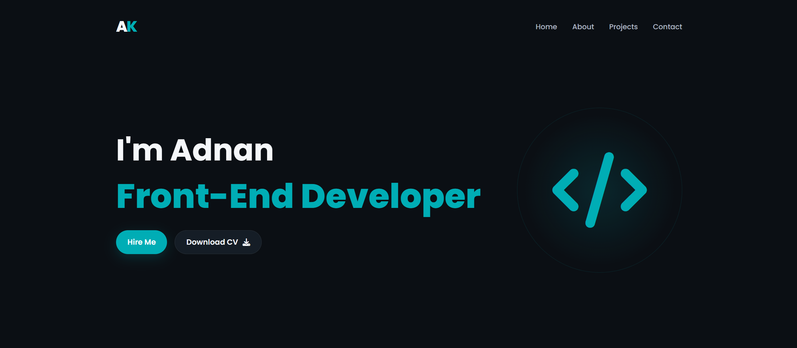
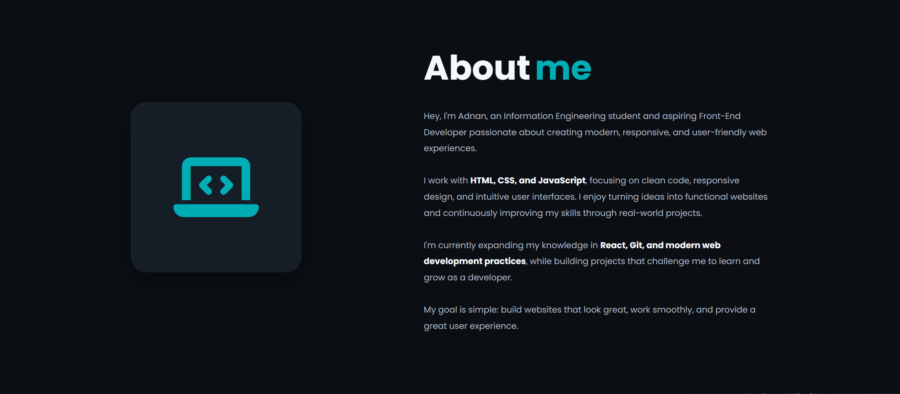
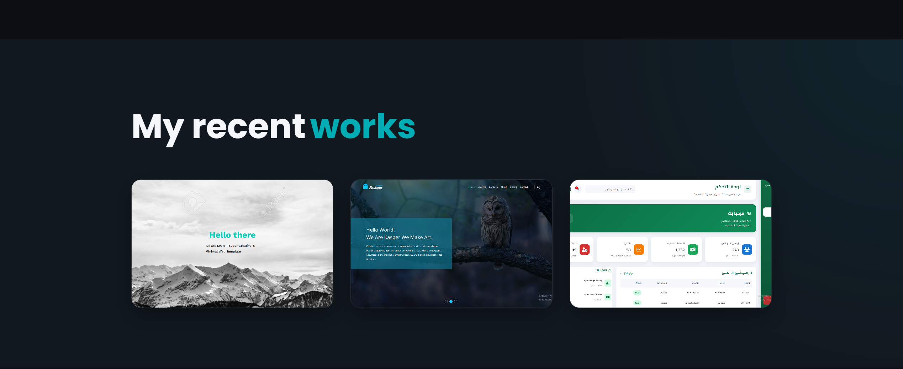
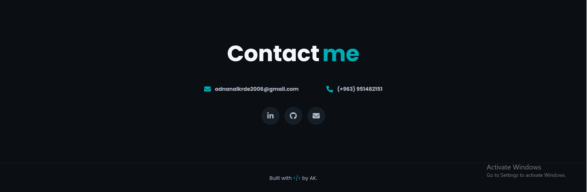

# Adnan Alkrde — Personal Portfolio

A modern and responsive personal portfolio website built to showcase my skills, projects, and journey as a Front-End Developer.

## 🌐 Live Demo

[View Live Portfolio](https://adnanalkrde.github.io/My-Portfolio/)

## 📸 Website Preview









## 👨‍💻 About Me

Hi, I'm Adnan Alkrde, an Information Engineering student and aspiring Front-End Developer.

I'm passionate about creating modern, responsive, and user-friendly web interfaces using HTML, CSS, and JavaScript.

I enjoy turning ideas and designs into clean and interactive web experiences while continuously improving my development and UI/UX skills.

## 🛠️ Technologies

* HTML5
* CSS3
* JavaScript
* Responsive Web Design
* Font Awesome
* Google Fonts
* Git
* GitHub

## ✨ Features

* Modern and clean dark interface
* Fully responsive design
* Personal introduction
* Skills showcase
* Projects section
* CV download
* Contact section
* Smooth scrolling
* Mobile-friendly layout

## 🎨 Design

The portfolio uses a modern dark theme with a minimal and professional visual style.

The design focuses on:

* Clean typography
* Responsive layouts
* Simple navigation
* Modern UI elements
* Consistent spacing and visual hierarchy

## 📄 CV

My CV is available inside the project:

[View My CV](assets/svg/Adnan%20AK%20CV%20%28En%29.pdf)

## 🚀 Purpose

This project serves as my personal portfolio and a place to showcase my web development projects, skills, and future work.

## 📬 Contact

If you'd like to get in touch or discuss a project, feel free to contact me through the portfolio website.

---

**Built by Adnan Alkrde**

## 📂 Project Structure

```text
My-Portfolio/
│
├── assets/
│   ├── imgs/
│   │   ├── portfolio-home.png
│   │   ├── portfolio-projects.png
│   │   └── portfolio-contact.png
│   │
│   └── svg/
│       └── Adnan AK CV (En).pdf
│
├── index.html
├── styles.css
└── README.md
```
